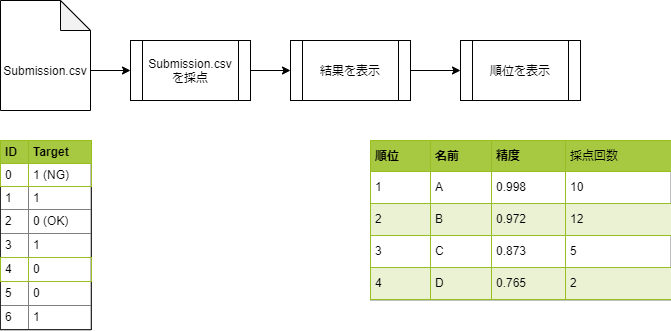
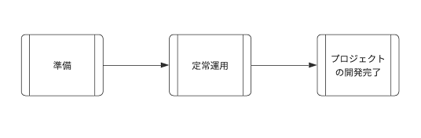
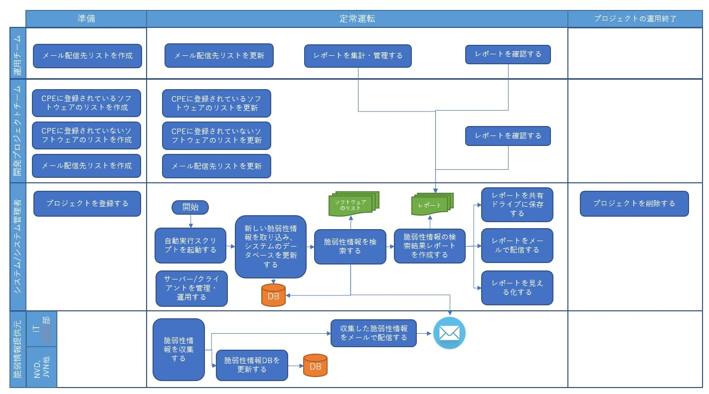
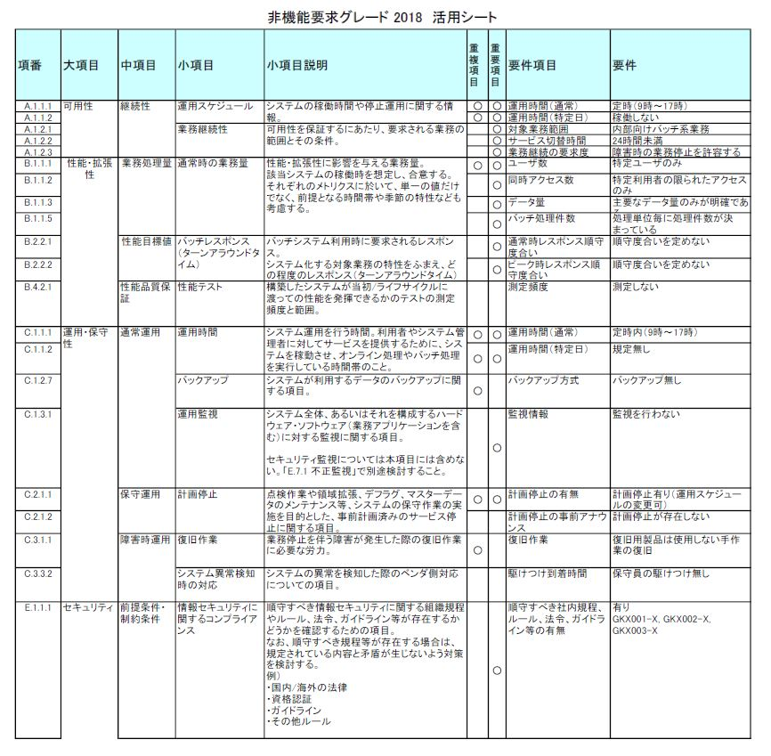
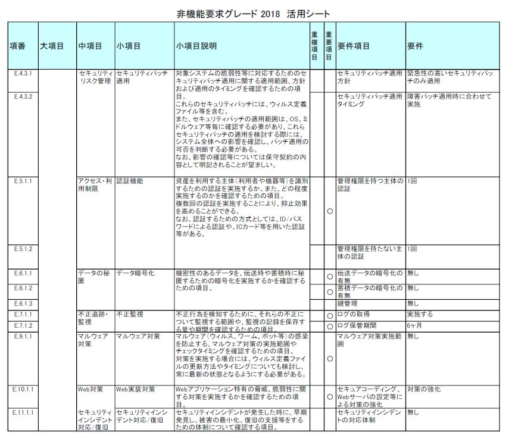

# 自動評価採点システム要件定義

## 1. 機能要件

### 1.1 ユースケース

- 利用者は、`CSV`ファイルをアップロードできる
  - `Jenkins`を利用する場合、`GitLab`への`CSV`ファイル登録（プッシュ）がトリガーになる
- 本システムは、提出された推論結果を採点（Score）できる
  - `jenkins`の「ビルド・トリガ」に採点用シェルスクリプトを記述し起動する
  - 正解率だけであれば、
    $$ 正解率 = \frac{OKの数}{IDの数} $$
  - 利用者が推論時に算出する精度をもって採点結果とすることができるのではないか？
  - 混合行列の正解率、適合率、・・・、F値を採点結果できないか？
- 本システムは、採点結果を表示できる
  - 表示するプラットホームを何にするか？
    - `GitLab`に、結果を戻して表示できるか？
    - `CentOS7`に、`sqlite3`が入っている
    - `CentOS7`に、テーブルを作り、クエリーを発行するか？
- 本システムは、採点結果から順位をつけることができる
  - 順位表は `Kaggle` の `Leaderboard` (LB) をイメージ
  - 正解率？精度？を降順に表示
  - 横軸：日にち、縦軸：正解率？精度？をラフ表示できる
    - グラフには、上位○○名の推移を同時に表示できる

#### ヒト

- 開発者（推論結果`csv`ファイルを提出する人）
- 利用者（順位と成績を見る第三者）
- 管理者

#### モノ

- サーバー
  - `Ubuntu16.04LTS`@xxx.xxx.xxx.xxx
  - `CentOS7`@yyy.yyy.yyy.yyy
- 推論結果`CSV`ファイル
- `Subumission`を受け取る環境
- `Submission`を採点するスクリプト
- 採点結果を表示するビューアー環境
- 採点結果と提出者のランキングを管理するデータベース
- 採点結果から順位を表示するスクリプト
- スクリプトを連携する`CI`環境（`Jenkins`）
- 

#### システム

- `Ubuntu16.04LTS`@xxx.xxx.xxx.xxx
- `CentOS7`@yyy.yyy.yyy.yyy
- Jenkins
- SQLite3

### 1.2. 機能詳細

- `Jenkins`が呼び出すスクリプト（`score.py`）の動作
  - 個人別予測ファイル（例えば、`submission_shimatani.csv`）を読み込む
  - 正解ファイル（`true.csv`）を読み込む
  - 予測ファイルと正解ファイルを結合し、予測・正解結合ファイル（`combined.csv`）を作成・保存する
  - 混合行列を計算し、個人別成績ファイル（`score_shimatani.csv`）を作成・保存する
  - 個人別成績ファイルから、各種メトリックスファイルを更新する
    - メトリックスファイルには、次のものがあり、それぞれに各個人の採点結果が記録されている
    - 正解率：`accuracy.csv`
    - 適合率；`precision.csv`
    - 再現率：`recall,csv`
    - F1値：`f1.csv`
  
  

  図　個人別予測ファイル、正解ファイル、予測・正解結合ファイルのデータ形式

  

  図　各種メトリックス・ファイルのデータ形式

  - データフレームの意味は次の通り
    - `data #` : データ番号
    - `predict` : 予測結果（`1`: NG, `0`: OK）
    - `true/false` : 正解値（`1`: NG, `0`: OK）
    - `name` :　提出者の名前
    - `date` :　提出日
    - `trial #` :　試行回数
    - `accuracy` :　正解率
    - `precision` :　適合率
    - `recall` :　再現率
    - `f1` :　F1価
    - `Mr.A` :　A氏氏
    - `Mr.B` :　B氏
    - `Mr.C` :　C氏
    - `Mr.D` :　D氏
 
- `Jenkins`が`score.py`の次に呼び出すスクリプト（`update_metrix.py`）の動作
  - メトリックス・ファイル（`accuracy.csv`, `precision.csv`, `recall.csv`, `f1.csv`）を読み込む
  - 予測・正解結合ファイル（`combined.csv`）を読み込む
  - メトリックス・ファイルの最後の行を読み込み、更新用の新しい行を作成する
  - 新しい行の提出者のセルに、各個人の成績ファイル（`score_shimatani.csv`）から読み取った成績を上書きする
  - メトリックス・ファイルの試行回数`trial`をインクリメントする
  - 新しい行をメトリックス・ファイルの最後の行に追加し保存する

図　成績ファイルからメトリックス・ファイルを更新する

## 2. 業務フロー

プロセス階層レベル（業務参照モデル）における各レベルのモデル化の目的は次のとおりである

- L1（組織）：　業務リスクや企業間連携
- L2（事業部・部門）：　業務改革設計と合意形成
- L3（業務機能）：　業務改革をビジネス改革として具体化
- L4（業務を構成するプロセス）：　ビジネスプロセス改革の実現やプロセス改善
- L5（プロセスを実現するアクティビティ）：　実行レベルのプロセス設計・実装やITモデル構築
- L6（タスクまたはITトランザクション）： L5と同じ

本システムは、開発部門に閉じたプロセスのため、L4以下の業務フローをビジネスプロセスモデル表記法（BPMN）を使ってモデル化する

- LV4 ビジネスライフサイクル図
  

- LV6 業務フロー図

## 3. 利用者要件

- 推論結果の提出者は、順位が確認できる

- 参加者は、順位が確認できる

## 4. 運用要件

### 4. 1. サービス運用が正しく行われるために必要な事項

- システムが稼働するサーバーは、<u>平日の 5:00 a.m. から 5:00 p.m.</u> の間稼働していること

- システム管理者は、<u>平日の 2:30 p.m. </u> に、ITインフラ部門が配信する「本日の脆弱性情報」メールを受信すること

- システム管理者のパソコンは、<u>平日の 2:00 p.m. から 4:00 p.m.</u> の間稼働していること

- 共有ドライブは、<u>平日の 5:00 a.m. から 5:00 p.m.</u> の間稼働していること

### 4. 2. システムの安定稼働を監視する事項

- 監視しない

### 4. 3. システム規模とシステム運用コストの概算目標

- システムが稼働するサーバー
  - 既設の`Ubuntu16.04LTS`サーバーを利用し、導入コスト：０、運用コスト：設備減価償却費、電気代程度

- 共有ドライブ
  - 会社の設備資産を利用し、導入コスト：０、運用コスト：共通費

- CIツール
  - `OSS` である `Jenkins` を利用し、導入コスト：０、運用コスト：０

- データベース
  - TBF
  
- スケジューラー
  - サーバー`Ubuntu16.04LTS`に含まれている`crontab`を利用し、導入コスト：０、運用コスト：０

## 5. 非機能要件

### 5. 1. 非機能要求グレード

- 可用性：
  - 稼働率は、95%以下
  - 稼働時間は、
    - サーバー：<u>平日の 5:00 a.m. から 5:00 p.m.</u> 
    - システム管理者のクライアントPC：
      - <u>平日の 2:00 p.m. から 4:00 p.m.</u> 
      - <u>平日の 2:30 p.m. </u> に、ITインフラ部門が配信する「本日の脆弱性情報」メールを受信できる
    - 共有ドライブ：<u>平日の 5:00 a.m. から 5:00 p.m.</u> 
  - 非冗長構成
- 性能：
  - 性能目標値に順守率・順守度合いを定めない
- 運用・保守性：
  - 運用監視は行わない
- セキュリティ：
  - セキュリティ設計基準、暗号方式選定基準、セキュアプログラミング基準 に準ずる

- IPAが提供している「非機能要求グレード2018」を用いて非機能要求を示す

## 6. 目標値  

### 6. 1. 機能要件を実現することで目指す目標値

- 運用チームと開発プロジェクトチームが、日々の脆弱性情報の収集と検索に要していた2時間/日・人×2名の工数を削減する

### 6. 2. 非機能要件を実現することで目指す目標値

- 可用性：
  - 稼働率95%以下
  - 稼働時間は平日の午前5時から午後5時まで
  - 非冗長構成
- 性能：
  - 性能目標値に順守率・順守度合いを定めない
- 運用・保守性：
  - 運用監視を行わない
- セキュリティ：
  - セキュリティ設計基準、暗号方式選定基準、セキュアプログラミング基準 に準ずる
